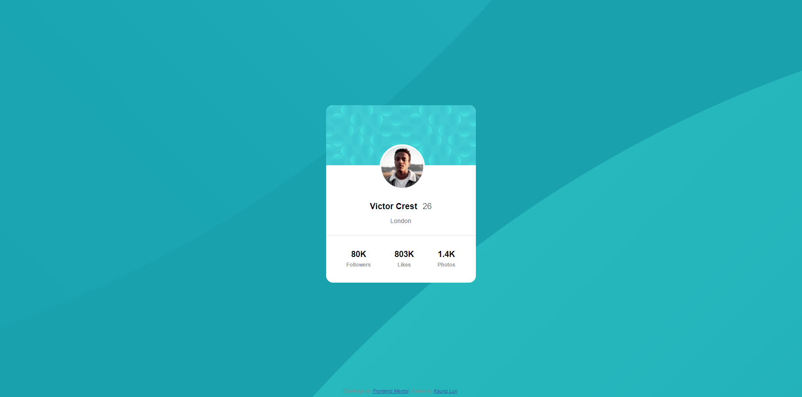
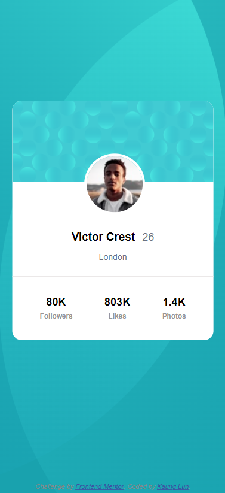

# Frontend Mentor - Profile card component solution

This is a solution to the [Profile card component challenge on Frontend Mentor](https://www.frontendmentor.io/challenges/profile-card-component-cfArpWshJ). Frontend Mentor challenges help you improve your coding skills by building realistic projects.

## Table of contents

- [Overview](#overview)
  - [The challenge](#the-challenge)
  - [Screenshot](#screenshot)
  - [Links](#links)
- [My process](#my-process)
  - [Built with](#built-with)
  - [What I learned](#what-i-learned)
  - [Continued development](#continued-development)
- [Author](#author)

## Overview

### The challenge

- Build out the project to the designs provided

### Screenshot




### Links

- Solution URL: [solution URL](https://github.com/lunk-kml/profile-card.git)
- Live Site URL: [live site URL](https://lunk-kml.github.io/profile-card/)

## My process

### Built with

- VS Code Editor
- Google Chrome (Inspect Mode)

### What I learned

- Wrap image in the <picture> element

- Using the <main> and <footer> in <body> to improve navigation and accessibility.

- Learned to make a picture look like a social media profile picture and also able to position on the header background image.

      ```css
      .profile {
        border-radius: 50%;
        border: 0.25rem solid white;
        object-fit: cover;
        margin: 5.4rem 7.7rem;

        position: absolute;
      }
      ```

### Continued development

- Need to be able to position the background image correctly.
- Need to be able to make texts elements appear next to each other without trouble. - inline, inline-block

## Author

- Website - [LunK-KML](https://github.com/lunk-kml)
- Frontend Mentor - [@lunk-kml](https://www.frontendmentor.io/profile/lunk-kml)
